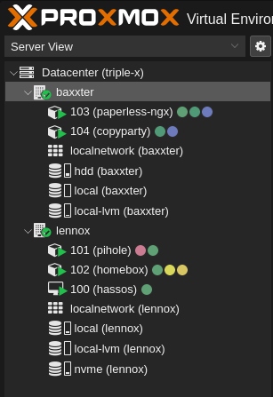

    <h1>Proxmox cluster</h1>

## The Idea

In September of 2025 I kinda became fed up with the whole [Home Assistant on Raspberry Pi](./home-assistant#the-setup) thing.
It worked alright, but my Raspberry Pi 3b was really sweating just running that.
And I needed to have another old PC at my desk for other things like [Paperless-ngx](https://docs.paperless-ngx.com/) and a simple [Samba server](https://github.com/dockur/samba).

So I decided: Lets just combine those two things!

I was already pretty familiar with Proxmox through my training at ZF. And I thought that would be the perfect use case.
I just had to get myself a bit better hardware.

## The setup

So, I went on to eBay Kleinanzeigen and kept my eyes open for any small form factor PCs people were selling.
Windows 10 was reaching EOL at the time, and sure enough people were ready to sell their Windows 11 incompatible PCs.

First I came across a Lenovo ThinkCentre M710q for just 35€:
- 4-Core Intel Core i3-6100T
- 8GB DDR4 RAM
- 128GB SSD

I put a set of 2x8GB DDR4 sticks in it I had lying around for more RAM, and bought a cheap 256GB NVMe SSD for more storage (CT volumes and VM disks).

Then I came across an IT service provider who was selling some HP EliteDesk 800 G2 Minis in bulk for 50€ each:
- 4-Core Intel Core i5-6500
- 8GB DDR4 RAM
- No storage

Again I bought a cheap 256GB NVMe SSD to run the system on, and a 2TB SeaGate HDD for mass storage.

After setting both nodes up with [Proxmox VE](https://www.proxmox.com/en/downloads) and making sure they run, I followed [this tutorial](https://www.bjoerns-techblog.de/2024/03/proxmox-cluster-erstellen/) to set up a 2 node cluster.
I planned on using the Lenovo node as a Raspberry Pi replacement and using the other one as a "on demand" node.

2 node clusters are somewhat unneccessary, since you're not really getting the most out of a cluster smaller then 3 nodes.
For me, the advantage is mostly managing them through just one web UI and waking the "on demand" node up using wake-on-lan when needed.

## What it is now

Right now, I've got the following services running on my cluster:
- **Node "Lennox"** - Running 24/7
  - **PiHole** - Keeping out pesky ads
  - **Homebox** - Managing my IT assets, since I sometimes can't remember where I left them
  - **Home Assistant** - Migrated over from the Raspberry Pi (without a single problem!)
- **Node "Baxxter"** - On demand
  - **Paperless-ngx** - Going mostly digital on documents
  - **Copyparty** - Accessing the HDD with a stupidly simple and cool UI

    

