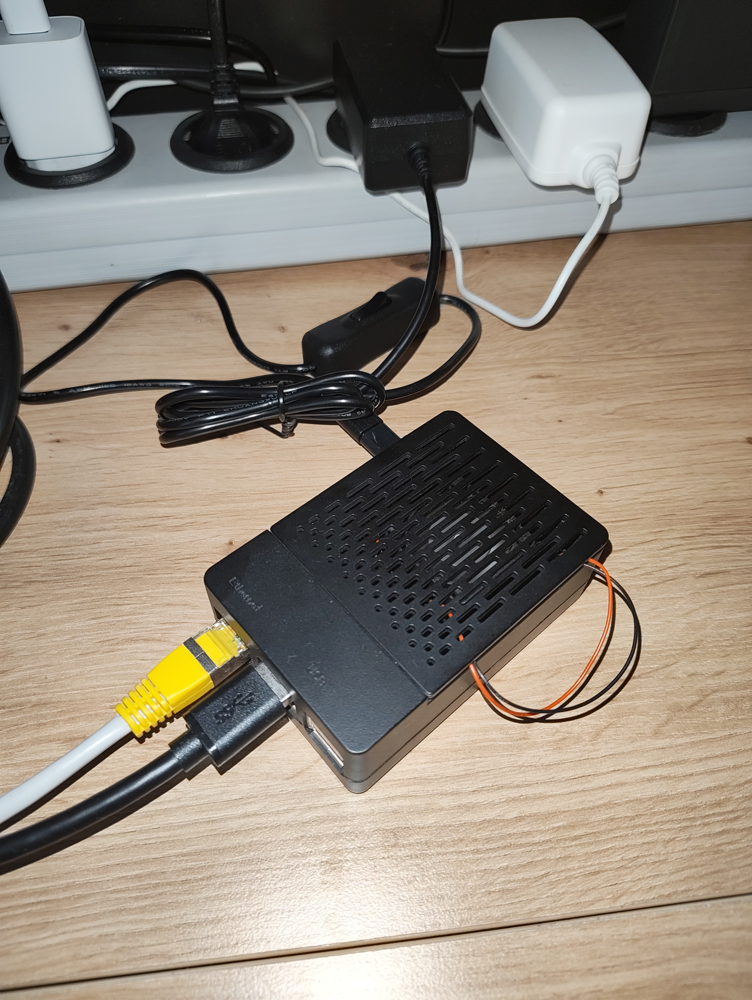
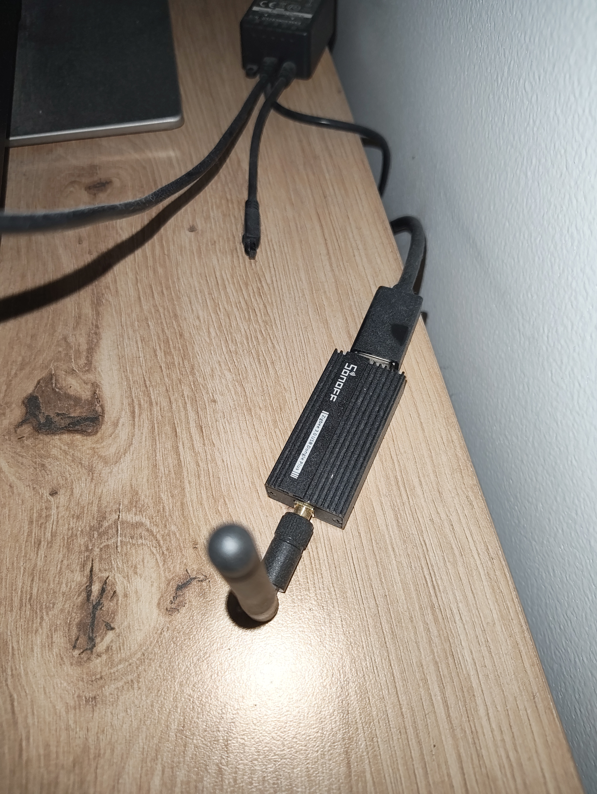
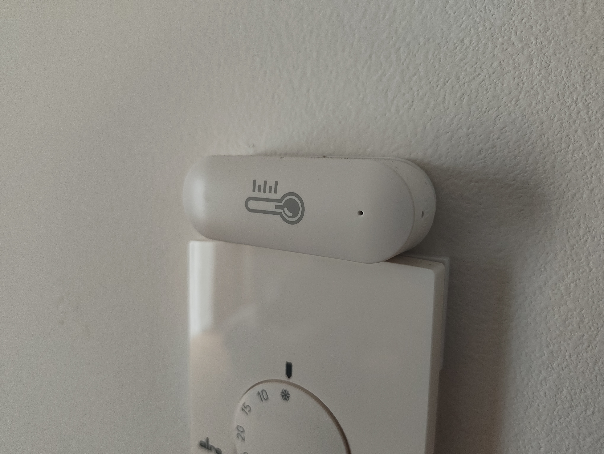
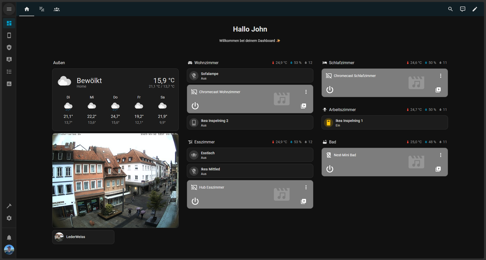

<h1 style="text-align: center">Home Assistant</h1>

## The idea

Beginning of 2024, while working with [Node-RED](https://nodered.org) as a trainee at ZF Friedrichshafen AG, I got the urge to make my home a bit smarter.

I had already heard a lot about [Home Assistant](https://www.home-assistant.io/) and was intrigued.
So I decided about a plan and was ready to buy some sensors to make myself a _Smart home_:

For years, I had an old [Raspberry Pi 3b](https://www.raspberrypi.com/products/raspberry-pi-3-model-b/) lying around.
I didn't use it for anything, so I decided that it would be my host. It's not very strong performance wise, but it gets the job done.
It does struggle with running some heavier plugins, since it only has 1GB of RAM. But as long as you're not expecting much, it can't disappoint.

I was already using some _Philips Hue_ smart RGB bulbs for some indirect lighting and 2 Chromecast from _Google_.
So, all I was missing were some sensors.

I decided to buy some temperature and humidity sensors, since they are the obvious
first choice. Easy to set up and can give some interesting insights. I decided on some [cheap AliExpress](https://de.aliexpress.com/item/1005006022905558.html) ones.

To get them connected to my _Home Assistant_, I needed a _Zigbee 3.0_ dongle which I also [got from AliExpress](https://de.aliexpress.com/item/4001251767556.html).

## The setup

Setting up _Home Assistant_ was as easy as following their [installation guide](https://www.home-assistant.io/installation/raspberrypi).
The _Raspberry Pi imager_ even has a dedicated option when choosing which OS to install!

After setting everything up, I got into designing my dashboards and setting everything up.

Almost two years later and after fiddling around, this is what the setup looks like now:

{width=200px}
{width=200px}
{width=200px}

During all my setup I encountered one problem I had to fix - the power supply.

At first, the default Raspberry Pi power supply was fine and everything worked perfectly.
After getting more and more sensors, automations, plugins and integrations set up however, it started to struggle.
This resulted in more and more errors thrown by the `RPi Power status` entity.

That resulted in me having to buy a stronger power supply. A [5V/4A one](https://amzn.eu/d/fS68lY7), resulting in 20W instead of the usual 10-15W.

## What it is now

Aside from that power supply though, _Home Assistant_ just works.
Even setting 3rd party things up, like [Ikea lights](https://www.ikea.com/de/de/p/tradfri-treiber-fuer-kabellose-steuerung-smart-grau-60342656/),
works perfectly with the _Zigbee 3.0_ dongle and the [Zigbee Home Automation](https://www.home-assistant.io/integrations/zha/) integration.

Even though it's nothing special and I don't have hundreds of sensors, I'm happy with it.
But there is so much more you can do with _Home Assistant_.
