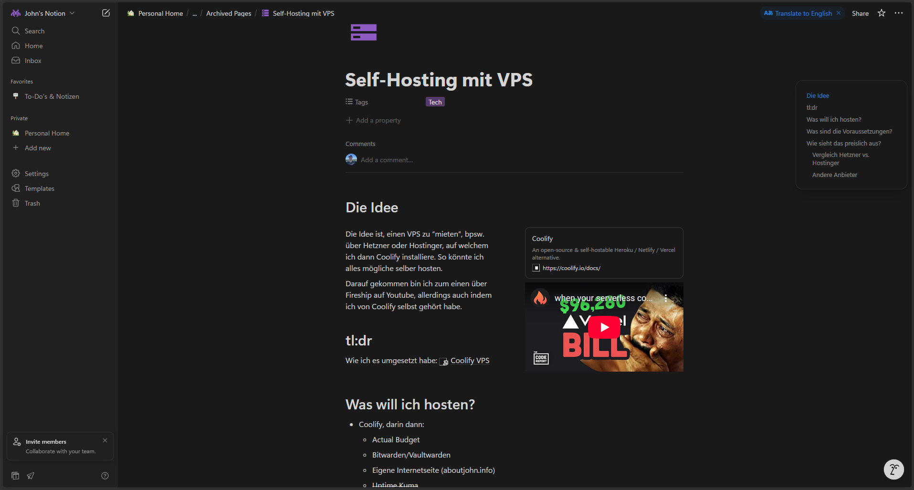
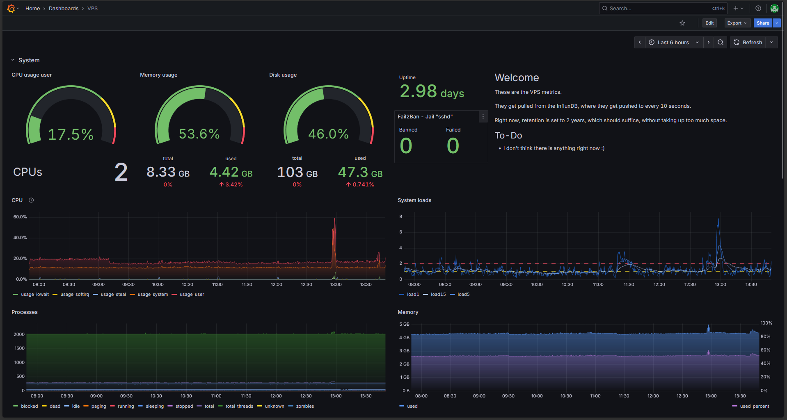
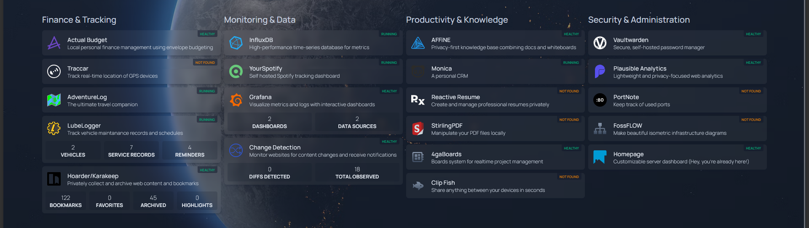

    <h1>My VPS</h1>

## The idea

The idea came, when I first heard about self-hosting in one of [Fireships](http://www.youtube.com/@Fireship) videos on YouTube:

    <iframe width="560" height="315" src="https://www.youtube.com/embed/SCIfWhAheVw?si=w30t68buIMGYsSWK" title="YouTube video player" frameborder="0" allow="accelerometer; autoplay; clipboard-write; encrypted-media; gyroscope; picture-in-picture; web-share" referrerpolicy="strict-origin-when-cross-origin" allowfullscreen></iframe>

Right at the end of the video, he talks about [Coolify](https://coolify.io) and how it can function at a self-hosted version of [Vercel](https://vercel.com).

Since I was already hosting a portfolio of mine on Vercel and had a running instance of [Actual Budget](https://actualbudget.org/) on [PikaPods](https://pikapods.com), I got curious.

What is _self-hosting_ about? What is _Coolify_? Could that be something for me?

## The setup

I went into _research mode_ and hacked together some information about _Coolify_ on my [Notion](https://notion.so):

    

First, I needed to decide on a VPS provider. I was struggling to decide between [Hostinger](https://hostinger.com) and [Hetzner](https://hetzner.com):

| Provider  |vCPUs	 | RAM (GB) | Disk space (GB) | Traffic (TB) | Price / Month (€) |
|-----------|:-----:|:--------:|:---------------:|:------------:|:-----------------:|
| Hetzner   |   4   |    8     |       80        |      20      |       8,09        |
| Hostinger |   2   |    8     |       100       |      8       |       5,99        |

During my research, I found out that _Coolify_ has a referral link for _Hetzner_ ([this one](https://coolify.io/hetzner)), giving you a bonus of **20€** when used.

In the end however I decided on using _Hostinger_, since their offer was a bit better and I already had an account there.

::: details Only later did I find out about other interesting providers

- [Ionos](https://ionos.de/server/vps#tarife)
  - 2 Core, 4GB RAM, 120GB SSD for 6€
- [Netcup](https://www.netcup.com/de/server/guenstige-vserver-angebote)
  - 4 Core, 4GB RAM, 120GB SSD for 4€

:::

I bought my _Hostinger_ VPS at the end of January 2025 and instantly installed _Coolify_.
I've been experimenting with it ever since - and I love it!

## What it is now

At the time of writing, I've got **20 services** and my **portfolio website** on that VPS.
Some services are not always running of course, but this is what my _Grafana_ dashboard is reporting at the moment:

    

That is with **35 docker containers** running. This is a list of all the current services:

    

Services indicating a _Not found_ status aren't running right now.

All of this for just 5,99€ per month and some brain grease.
